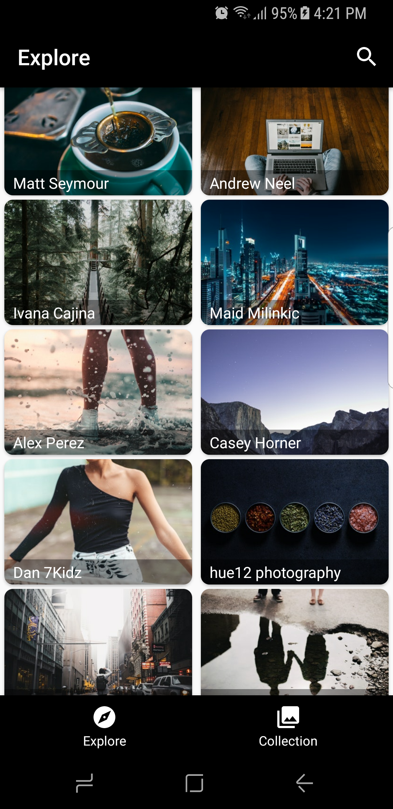
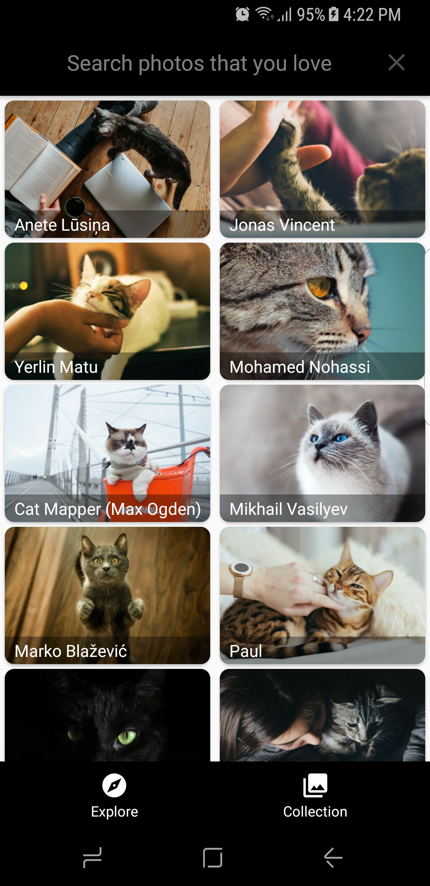

# Hoga
[](https://app.bitrise.io/app/3f9c2569792e3061)

A mobile image box allows you to search and download free and beautiful pictures which you definitely love. 

`Hoga` = `Hộp`('Box' in Vietnamese) + `Gazo`-画像 ('Image' in Japanese)

  

## Target Audience
* *For the beautiful photo lover*  
Build and run this app to get amazing images into your pocket. 

* *For the technical explorer*  
This project is built on **Clean Architecture**. 
Besides, there are several technical stuffs such as Kotlin, reactive programming and dependence injection, or testing that you might be interested in.

## Features
- Search and view beautiful pictures
- Download favorite images
- Set phone wallpaper with your truly love one

## Technical Specification
* Programming language: Kotlin
* Architecture: Clean architecture
* Coding convention: [Code style](https://github.com/mcrafts/mobile-guidelines/blob/master/android-code-conventions.md)
* Libraries: RxJava2, Dagger2, OkHttp, Retrofit, JUnit, Mockito, Espresso.

## How to build it

Thanks to Unsplash, this project uses their crafted clean API to fetch beautiful images.  
- Firstly, let's head to [Unsplash's developer page](https://unsplash.com/developers) to get your own API token.  
- Secondly, put it inside your `local.properties` file as following:
```gradle
unsplashToken=Client-ID ***************
```  
- Finally, here you go. Let's run.

**For CI/CD:** It is necessary to add a mockup 'local.properties' file.
For Bitrise, add the following script into the "Do anything with Script step".
```bash
# Add template local.properties file
echo 'Generating local.properties ...'

cat > "./local.properties" <<- FILE_CONTENT
unsplashToken=Client-ID xxxxSAMPLExxxx
FILE_CONTENT"
```

Besides, Bitrise default Java version is Java 8, but the app needs Java 11 to run. So, it should be setup in the same step.
```bash
# Install and use java 11
sudo update-alternatives --set javac /usr/lib/jvm/java-11-openjdk-amd64/bin/javac
sudo update-alternatives --set java /usr/lib/jvm/java-11-openjdk-amd64/bin/java
export JAVA_HOME='/usr/lib/jvm/java-11-openjdk-amd64'
envman add --key JAVA_HOME --value '/usr/lib/jvm/java-11-openjdk-amd64'
```

## License
This project is available under the MIT license. See the LICENSE file for more info.

---
If you are interested in my useful blog posts and cool projects, you can subscribe to my newsletter by clicking the below link.  
[SUBSCRIBE TO USEFUL BLOG POSTS AND COOL PROJECTS.](http://eepurl.com/g1nqlf)
